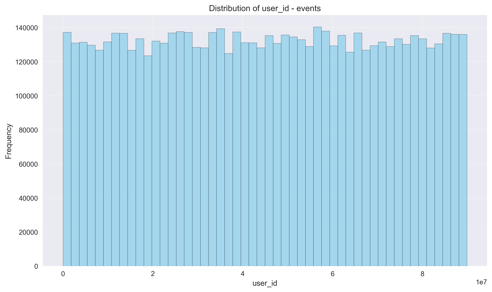
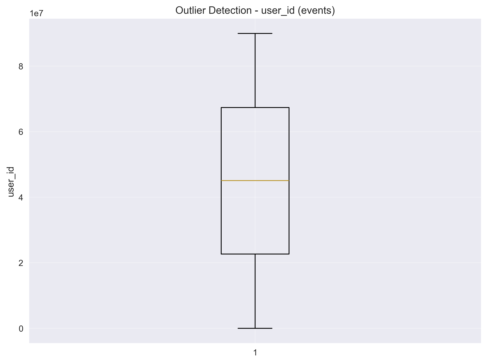
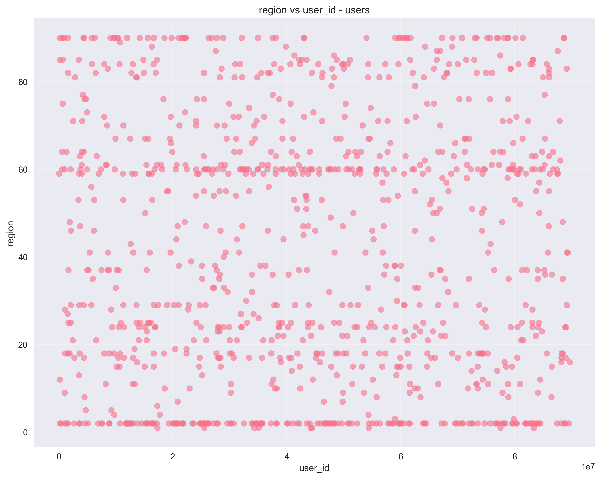
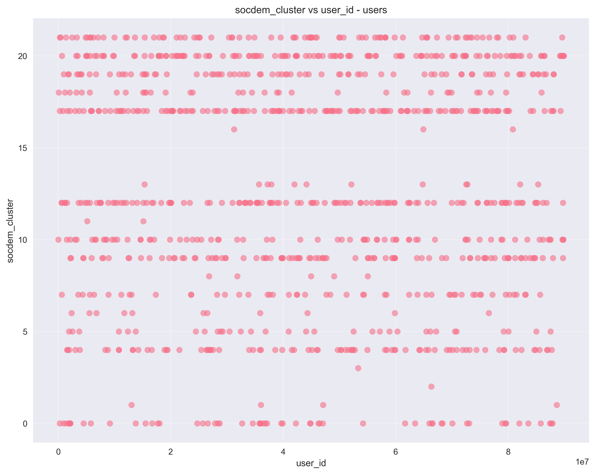
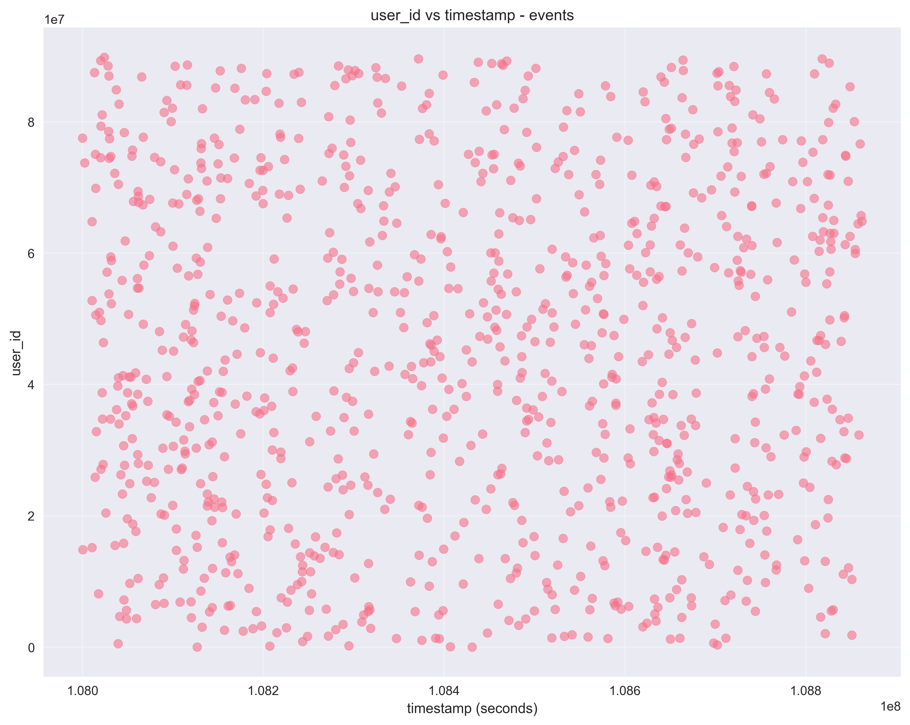

# Разведочный анализ данных (EDA) для T-ECD датасета

## Введение

В рамках данного домашнего задания был проведен разведочный анализ данных (EDA) для [датасета T-ECD](https://huggingface.co/datasets/t-tech/T-ECD). Анализ включал в себя изучение структуры данных, вычисление базовых статистик, визуализацию распределений, корреляционный анализ и другие методы исследования данных.

## Выбор задачи и метрик

#### Постановка:  
В рамках курса требуется реализовать модель для персонифицированных товарных рекомендаций на маркетплейсе («marketplace» домен). Основная цель — повысить конверсию пользователей за счёт более точного ранжирования товаров, чтобы показывать каждому наиболее релевантные позиции и стимулировать целевые действия (клик, покупка, добавление в корзину).

#### ML-постановка: 
Задача формулируется как задача регрессии: для каждой пары "пользователь-товар", используя доступные признаки по пользователям и товарам, а также историю взаимодействий, предсказать вещественное значение (score) от 0 до 1 — вероятность того, что пользователь выполнит целевое действие с этим товаром. Полученные значения используются для ранжирования и формирования индивидуальных рекомендательных списков.

#### Описание датасета:
Для решения задачи используется поднабор T-ECD `t_ecd_small_partial` с ограничением `domains=["marketplace"]` и определённым периодом взаимодействий (`day_begin=1250, day_end=1310`). В датасете содержатся пары (user_id, item_id) с признаками пользователей, товаров и историей действий (просмотр, клик, корзина, покупка), что является достаточным для обучения регрессионной ML-модели.

**Сравнительная таблица регрессионных метрик**

| Метрика | Определение | Плюсы | Минусы |
|---------|-------------|-------|--------|
| MAE     | Среднее абсолютное отклонение между предсказанным и реальным значением | Легко интерпретируется, устойчива к выбросам | Не штрафует большие ошибки сильнее, чем малые |
| MSE     | Среднее квадратичное отклонение | Усиливает штраф за крупные ошибки, позволяет лучше оптимизировать | Размерность неинтуитивна, чувствительна к выбросам |
| RMSE    | Корень из среднеквадратичной ошибки | Остаётся в масштабе целевой переменной, чувствителен к большим ошибкам | Могут влиять выбросы |
| R²      | Коэффициент детерминации | Интуитивно понятно: показывает долю объяснённой дисперсии | Может быть неинформативен при сложном распределении target |

#### Итого:

Основная метрика - **MAE**. Как побочные метрики также будут учитываться *RMSE** и **R²**

## Обзор датасетов

В ходе анализа были загружены и изучены следующие датасеты:

- **users**: 3,500,000 строк, 3 столбца
- **events**: 6,627,693 строк, 6 столбцов

Также предпринимались попытки загрузить данные из файлов brands.pq и items.pq, но они завершились ошибками.

## Структура данных

### Users датасет

Столбцы:
- user_id (uint64)
- socdem_cluster (float64)
- region (float64)

### Events датасет

Столбцы:
- timestamp (timedelta64[us])
- user_id (uint64)
- item_id (object)
- subdomain (object)
- action_type (object)
- os (object)

## Анализ качества данных

### Пропущенные значения

**Users датасет:**
- region: 58,917 пропущенных значений (1.68%)
- socdem_cluster: 5,153 пропущенных значения (0.15%)

**Events датасет:**
- subdomain: 1,453 пропущенных значения (0.02%)

### Дубликаты

В обоих датасетах дубликаты отсутствуют:
- users: 0 дубликатов (0.00%)
- events: 0 дубликатов (0.00%)

## Основные статистики

### Users датасет

**socdem_cluster:**
- Среднее значение: 12.8190
- Медиана: 12.0000
- Стандартное отклонение: 6.4636
- Мода: 17.0

**region:**
- Среднее значение: 40.4486
- Медиана: 37.0000
- Стандартное отклонение: 29.2757
- Мода: 2.0

### Events датасет

**timestamp:**
- Среднее значение: 1254 дней 23:32:14
- Медиана: 1255 дней 02:36:27
- Стандартное отклонение: 2 дня 21:08:03
- Мода: 1256 дней 07:57:50

## Визуализации

### Распределения

### Категориальные переменные

### Корреляционные матрицы

### Пропущенные данные

### Выбросы

### Временные ряды

### Диаграммы рассеяния

## Выводы

1. Датасеты users (3,500,000 строк) и events (6,627,693 строк) успешно загружены и содержат значительный объем данных.
2. В датасетах присутствуют пропущенные значения: 58,917 (1.68%) в переменной region и 5,153 (0.15%) в переменной socdem_cluster датасета users, а также 1,453 (0.02%) в переменной subdomain датасета events.
3. Дубликаты в данных отсутствуют (0 дубликатов в обоих датасетах).
4. Распределения некоторых переменных имеют выраженные особенности: переменная region имеет моду 2.0 при среднем значении 40.4486, переменная socdem_cluster имеет моду 17.0 при среднем значении 12.8190.
5. Временные метки событий охватывают период примерно в 10 дней (с 1250 по 1259 день).
6. Существует разнообразие типов действий пользователей и поддоменов, что видно на соответствующих визуализациях.

## Рекомендации

1. Обработать пропущенные значения в переменных region и socdem_cluster датасета users.
2. Рассмотреть возможность трансформации числовых переменных с выраженной асимметрией. Например, переменная region имеет стандартное отклонение (29.2757) значительно большее, чем её среднее значение (40.4486), что может указывать на сильную асимметрию распределения. Такие переменные могут потребовать преобразования.
3. Исследовать выбросы для определения их корректности.
4. Использовать корреляционный анализ для информирования о выборе признаков при моделировании.
5. Учитывать временные паттерны в данных событий при создании временных признаков. Анализ временных рядов показал активность событий в различные периоды времени. При создании признаков для моделей можно использовать информацию о временных паттернах, например, создать признаки для определенных часов дня, дней недели или временных интервалов, когда наблюдается пик активности пользователей.
